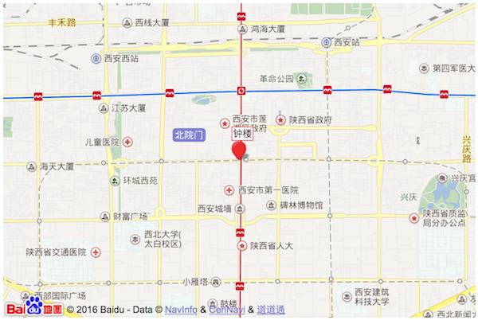

# 百度地图组件

## 栗子



```html
<div class="baidu-map-widget"
  data-width="600"
  data-height="400"
  data-center="108.953382,34.265678,14"
  data-marker="108.953382,34.265678"
  data-markerlabel="钟楼">
</div>
<script type="text/javascript" src="http://baidu-map-widget.basten.me/widget.js"></script>
```

## 使用

```html
<div class="baidu-map-widget"
  data-center="108.953382,34.265678,14"
  data-marker="108.953382,34.265678"></div>
<script type="text/javascript" src="http://baidu-map-widget.basten.me/widget.js"></script>
```

Data Options:
* center: "经度,纬度,级别"
* width:   默认 100%
* height:  默认 200
* marker: "经度,纬度"
* markerlabel: 标注的说明(需要和marker一起使用)
* ak: 默认自带ak, 也可以自定义 [ak](http://lbsyun.baidu.com/index.php?title=jspopular).

或者直接使用 iframe
```html
<iframe src="http://baidu-map-widget.basten.me/widget.html?center=108.953382,34.265678,14&marker=108.953382,34.265678&markerlabel=钟楼&height=400" width="100%" height="400"></iframe>
```

## TODO
* controls
* infowindow
* https
